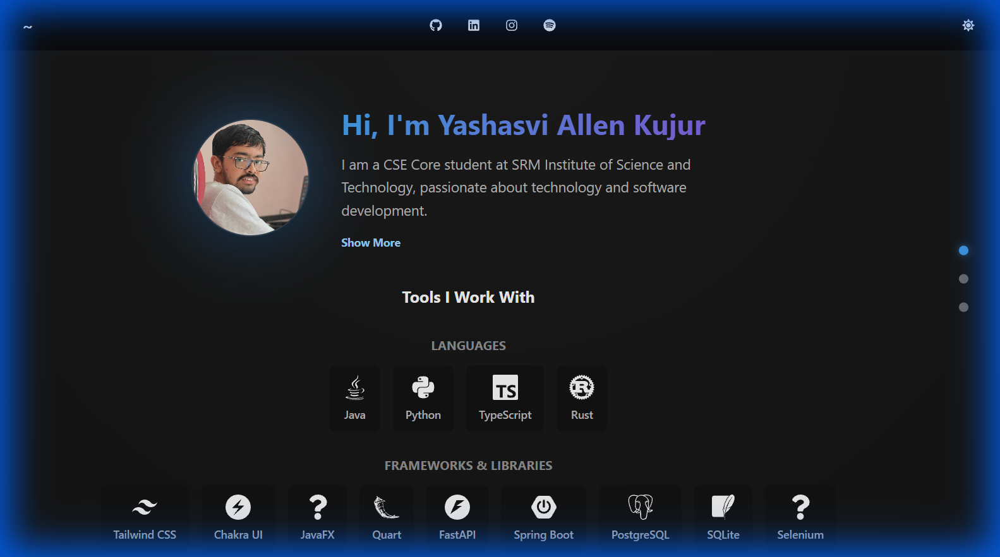

# My Portfolio

A personal portfolio website built with React, TypeScript, and Vite, featuring a modern design with animations and a responsive layout.



## 🚀 Tech Stack

- **Framework**: [React](https://reactjs.org/)
- **Language**: [TypeScript](https://www.typescriptlang.org/)
- **Build Tool**: [Vite](https://vitejs.dev/)
- **Styling**: [Chakra UI](https://chakra-ui.com/), [Emotion](https://emotion.sh/)
- **Animations**: [Framer Motion](https://www.framer.com/motion/)
- **Icons**: [React Icons](https://react-icons.github.io/react-icons/)

## 🛠️ Installation

1.  **Clone the repository:**

    ```bash
    git clone https://github.com/yourusername/my-portfolio.git
    cd my-portfolio
    ```

2.  **Install dependencies:**

    ```bash
    npm install
    ```

## 🏃‍♂️ Usage

### Development

To start the development server with hot reload:

```bash
npm run dev
```

Open [http://localhost:5173](http://localhost:5173) in your browser.

### Production Build

To build the project for production:

```bash
npm run build
```

To preview the production build locally:

```bash
npm run preview
```

## 📝 Customization

You can easily update the portfolio content without touching the component code. All personal details, projects, and skills are stored in `src/data/me.ts`.

1.  Open `src/data/me.ts`.
2.  Update the following fields:
    - `name`: Your name.
    - `image`: URL to your profile picture.
    - `tags`: Your titles (e.g., "Full Stack Developer").
    - `languages`: List of programming languages you know.
    - `frameworks`: Categorized list of frameworks and tools.
    - `projects`: Array of your projects.
    - `contacts`: Social media links.
    - `journey`: Your education and work experience.
    - `desc_brief`: A short bio.
    - `desc`: A detailed bio.

## 📂 Project Structure

```
my-portfolio/
├── public/              # Static assets
├── src/
│   ├── components/      # React components
│   ├── data/            # Data files (me.ts)
│   ├── App.tsx          # Main application component
│   └── main.tsx         # Entry point
├── index.html           # HTML template
├── package.json         # Project dependencies and scripts
├── tsconfig.json        # TypeScript configuration
└── vite.config.ts       # Vite configuration
```

## 📄 License

[MIT](LICENSE)
