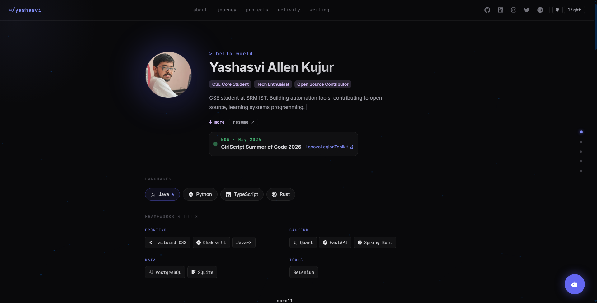
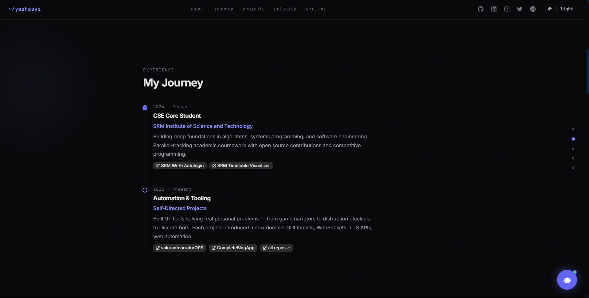
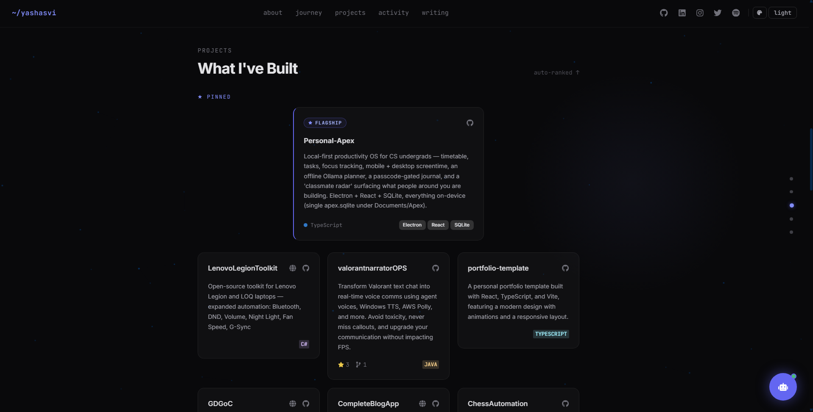
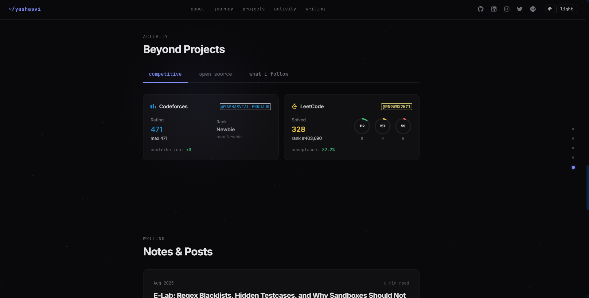
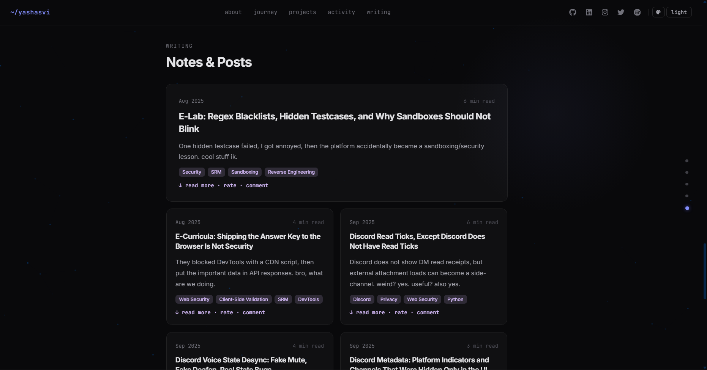
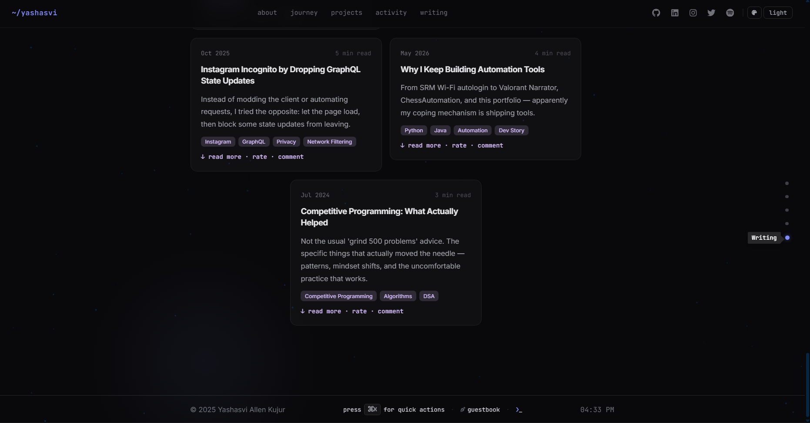

# Portfolio

A personal portfolio template built with React, TypeScript, and Vite. All content lives in one file (`src/data/me.ts`), so you fill in your details and never touch component code.



## The Front Page

One scrolling page, six sections. A right-side dot navigator (desktop) and a sticky top nav both jump between them.

### Hero


Avatar, an animated typing bio, and role tags. A live **Now** card highlights what you are currently working on. Below it, your stack: primary languages as pills (first one starred), then frameworks and tools grouped side by side into **Frontend**, **Backend**, **Data**, and **Tools**. Unrecognized tools show their name without a placeholder icon.

### My Journey



A vertical timeline of roles and milestones. Each entry is dated and can carry "evidence" links that back up the claim (repos, demos, write-ups).

### What I've Built



Pinned flagship work sits on top, marked with a star accent. Below it, a grid auto-ranked from your GitHub by stars, recency, and topics. Cards show language, stars/forks, and links to repo and live demo. You can also merge hand-written projects into the ranked grid.

### Beyond Projects



Tabbed activity:

- **competitive** - live Codeforces and LeetCode stats via public APIs, with graceful fallback if an API is slow or down
- **open source** - recent contributions from the GitHub Events API
- **what i follow** - accounts and projects you keep up with

### Notes & Posts



An inline blog. Posts expand in place with tags, references, and a comment link, so there is no external CMS to run.



The footer carries a `⌘K` command-palette hint, a guestbook link, a console prompt, and a live clock.

## Features

- Particle constellation background with mouse parallax, plus a cursor spotlight
- 10 color themes; several add audio-visual effects, the four minimal ones also support light mode
- Command palette (`⌘K`), keyboard navigation (`g` then a section key), and a `?` shortcuts modal
- Console page, mini-games (`/play`), guestbook, and hidden achievements
- Easter eggs: Konami code, matrix rain, rainbow mode, logo-click confetti
- AI chat widget backed by the Gemini API, proxied server-side and primed on your `me.ts`
- Responsive and mobile-friendly; respects `prefers-reduced-motion`

## Quick Start

```bash
git clone https://github.com/yourusername/my-portfolio.git
cd my-portfolio
npm install
cp src/data/me.example.ts src/data/me.ts   # then edit me.ts
npm run dev
```

Open [http://localhost:5173](http://localhost:5173).

`me.ts` is the single source of truth: name, bio, journey, projects, blog posts, contacts, and theme defaults. Project repos are auto-fetched and scored from GitHub with `npm run fetch-repos`.

The FastAPI backend (guestbook, visitor count, Spotify proxy, AI chat) is optional. Without it, those features fall back gracefully. See [`backend/README.md`](backend/README.md) to deploy, and [`DEPLOY.md`](DEPLOY.md) for full production setup (nginx + systemd).

## AI Chat (optional)

A floating widget calls the backend at `/api/portfolio/chat`, which proxies the Gemini API. The key stays server-side. The system prompt is built from `me.ts`.

1. Get a free key at [aistudio.google.com/apikey](https://aistudio.google.com/apikey)
2. Add to `backend/.env`:

```bash
GEMINI_API_KEY=AIza...
GEMINI_MODEL=gemini-2.0-flash   # default, works on all free-tier keys
```

3. Restart: `sudo systemctl restart portfolio-api`

If the key is missing, the chat button shows offline and the rest of the site works normally. Model options and rate limits live in [`backend/README.md`](backend/README.md).

## Spotify Now Playing (optional)

Set `nowPlayingApi` on the Spotify contact in `me.ts` to a deployed [spotify-github-profile](https://github.com/kittinan/spotify-github-profile) endpoint. The badge then shows a live now-playing popover; without it, it stays a plain link.

## Project Structure

```
src/
  components/   UI sections and widgets
  pages/        Routed pages (console, play, guestbook, ...) + games/
  data/         me.ts (your content) and me.example.ts (template)
  themes/       Theme palettes
  services/     Tech and social icon mapping
  lib/          Achievements and helpers
  hooks/        Custom hooks
  App.tsx       Routes and layout
  theme.ts      Chakra theme
  index.css     Global styles and per-theme variables
```

## Deployment

```bash
npm run build   # outputs to dist/
```

Deploy `dist/` to any static host (Vercel, Netlify, GitHub Pages, Cloudflare Pages). The optional backend deploys separately.

## License

[MIT](LICENSE)
