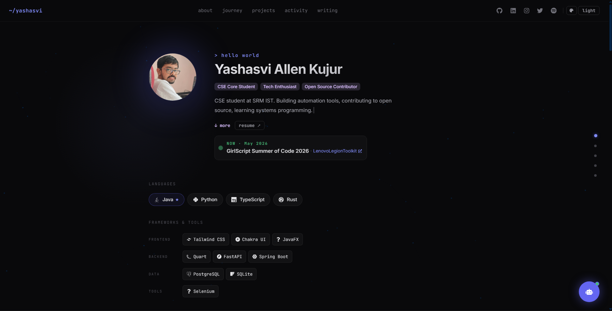

# Portfolio

A personal portfolio template built with React, TypeScript, and Vite. All content lives in a single file — no component code to touch.



## Features

- Particle constellation background
- Animated hero with typing effect, tags, and scroll cue
- **Currently Building** — live indicator for what you're working on now
- **Competitive Programming** — live Codeforces + LeetCode stats via public APIs
- **Blog** — inline expandable posts, no external service needed
- **Ollama AI Chat** — floating widget powered by a local LLM that knows your portfolio
- Timeline journey section
- Projects grid with tech badges
- Section navigator dots
- Dark / light mode toggle
- Responsive, mobile-friendly

## Tech Stack

| | |
|---|---|
| Framework | [React 18](https://reactjs.org/) + [TypeScript](https://www.typescriptlang.org/) |
| Build | [Vite](https://vitejs.dev/) |
| UI | [Chakra UI v2](https://chakra-ui.com/) |
| Animation | [Framer Motion](https://www.framer.com/motion/) |
| Icons | [React Icons](https://react-icons.github.io/react-icons/) |
| Fonts | Inter + JetBrains Mono (Google Fonts) |

## Quick Start

```bash
git clone https://github.com/yourusername/my-portfolio.git
cd my-portfolio
npm install
cp src/data/me.example.ts src/data/me.ts
# Edit src/data/me.ts with your details
npm run dev
```

Open [http://localhost:5173](http://localhost:5173).

## Customization

Everything is in `src/data/me.ts`. The file is well-commented — copy from `me.example.ts` and fill in your details.

### Core fields

| Field | Description |
|---|---|
| `name` | Full name — used in title, footer, navbar, and AI chat |
| `image` | Direct URL to your profile photo |
| `tags` | Short descriptors shown as pills in the hero |
| `languages` | Programming languages — auto-mapped to icons |
| `frameworks` | Categorized tools: `frontend`, `backend`, `databases`, `misc` |
| `desc_brief` | One-sentence bio (shown by default) |
| `desc` | Full bio (revealed on "show more") |
| `contacts` | Social links — `id` maps to icon (`github`, `linkedin`, `twitter`, `spotify`, etc.) |
| `journey` | Timeline entries: `title`, `company`, `date`, `description` |
| `projects` | Projects: `name`, `description`, `links[]`, `skills[]` |

### New fields

#### `cp` — Competitive Programming

```ts
cp: {
  codeforces: "your_handle",  // fetches live from codeforces.com/api
  leetcode: "your_handle",    // fetches live from leetcode-stats-api.herokuapp.com
},
```

Leave as empty string `""` to show a graceful fallback link instead of stats.

#### `currentWork` — Currently Building

```ts
currentWork: {
  title: "Project Name",
  org: "Organization",
  orgUrl: "https://github.com/org/project",
  description: "What you're building and why.",
  links: [{ name: "Repository", link: "https://..." }],
  tags: ["C#", "WPF"],
  startDate: "May 2025",
},
```

#### `blogs` — Writing

```ts
blogs: [
  {
    title: "Post Title",
    date: "Month Year",
    readTime: "5 min read",
    excerpt: "Hook sentence shown on the card.",
    tags: ["Tag1", "Tag2"],
    // For inline content (expands in page):
    content: `Full post text here.`,
    // OR for external link (opens in new tab):
    link: "https://dev.to/you/post",
  },
],
```

### Ollama AI Chat

The floating robot button in the bottom-right connects to a local [Ollama](https://ollama.com) instance. It auto-builds a system prompt from your `me.ts` data — no hardcoded content.

**Setup:**

```bash
# Install Ollama: https://ollama.com
ollama pull llama3.2   # or any model you prefer
ollama serve           # starts the API on localhost:11434
```

The chat widget will show a green dot when Ollama is running and auto-detects the available model. It works entirely offline — no API keys, no external services.

If Ollama is not running, the button shows a tooltip and the input is replaced with setup instructions.

## Project Structure

```
my-portfolio/
├── src/
│   ├── components/
│   │   ├── Intro.tsx              # Hero section
│   │   ├── CurrentlyBuilding.tsx  # "Now" section
│   │   ├── CPStats.tsx            # Codeforces + LeetCode
│   │   ├── Journey.tsx            # Timeline
│   │   ├── Projects.tsx           # Projects grid
│   │   ├── Blog.tsx               # Inline blog posts
│   │   ├── OllamaChat.tsx         # AI chat widget
│   │   ├── ParticleBackground.tsx # Canvas constellation
│   │   ├── NavBar.tsx             # Sticky nav with section links
│   │   ├── SectionNavigator.tsx   # Dot nav (desktop)
│   │   ├── Footer.tsx
│   │   ├── ContactBadges.tsx
│   │   └── ColorModeToggle.tsx
│   ├── data/
│   │   ├── me.ts          # Your content (gitignored if you fork)
│   │   └── me.example.ts  # Template
│   ├── services/
│   │   ├── getTechIcon.ts       # Tech name → React Icon
│   │   └── favicon-site-url.ts  # Social id → React Icon
│   ├── App.tsx    # Layout + section wiring
│   ├── theme.ts   # Chakra UI theme (colors, fonts, animations)
│   └── index.css  # Scrollbar, fonts, scroll-behavior
├── index.html
└── vite.config.ts
```

## Deployment

```bash
npm run build   # outputs to dist/
```

Deploy the `dist/` folder to any static host: Vercel, Netlify, GitHub Pages, Cloudflare Pages.

> **Note:** The Ollama chat only works when the viewer has Ollama running locally — it's a personal/demo feature, not a hosted service.

## License

[MIT](LICENSE)
